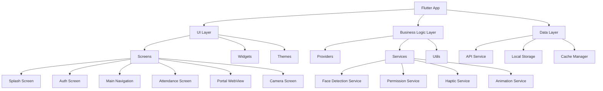

# Design Document

## Overview

This design document outlines the comprehensive architecture and implementation approach for transforming the existing Flutter Student Attendance App into a production-ready application. The design focuses on modern UI/UX principles, robust face detection integration, seamless webview portal access, and enhanced user experience through animations and haptic feedback.

## Architecture

### High-Level Architecture



### Design System Architecture

The app will implement a comprehensive design system based on Material Design 3 principles with custom branding:

- **Color Palette**: Primary Blue (#2196F3), Navy Blue (#1565C0), White (#FFFFFF)
- **Typography**: Roboto font family with consistent text scales
- **Component Library**: Reusable widgets following atomic design principles
- **Animation System**: Consistent timing and easing curves throughout the app

## Components and Interfaces

### 1. Design System Components

#### Color System
```dart
class AppColors {
  static const Color primary = Color(0xFF2196F3);
  static const Color primaryDark = Color(0xFF1565C0);
  static const Color surface = Color(0xFFFFFFFF);
  static const Color background = Color(0xFFF8F9FA);
  static const Color onPrimary = Color(0xFFFFFFFF);
  static const Color onSurface = Color(0xFF1A1A1A);
  static const Color success = Color(0xFF4CAF50);
  static const Color error = Color(0xFFE53E3E);
  static const Color warning = Color(0xFFFF9800);
}
```

#### Typography System
```dart
class AppTextStyles {
  static const TextStyle headline1 = TextStyle(
    fontSize: 32,
    fontWeight: FontWeight.bold,
    letterSpacing: -0.5,
  );
  static const TextStyle headline2 = TextStyle(
    fontSize: 24,
    fontWeight: FontWeight.w600,
    letterSpacing: -0.25,
  );
  // Additional text styles...
}
```

#### Animation Constants
```dart
class AppAnimations {
  static const Duration fast = Duration(milliseconds: 200);
  static const Duration medium = Duration(milliseconds: 300);
  static const Duration slow = Duration(milliseconds: 500);
  
  static const Curve easeInOut = Curves.easeInOut;
  static const Curve bounceIn = Curves.bounceIn;
}
```

### 2. Navigation Architecture

#### Bottom Navigation Structure
The app will use a modern bottom navigation with two main sections:
- **Attendance Tab**: Main attendance marking functionality
- **Portal Tab**: Integrated student portal webview

#### Navigation Service
```dart
class NavigationService {
  static final GlobalKey<NavigatorState> navigatorKey = GlobalKey<NavigatorState>();
  
  static Future<T?> pushNamed<T>(String routeName, {Object? arguments}) {
    return navigatorKey.currentState!.pushNamed<T>(routeName, arguments: arguments);
  }
  
  static void pop<T>([T? result]) {
    return navigatorKey.currentState!.pop<T>(result);
  }
}
```

### 3. Face Detection Integration

#### Face Detection Service Architecture
The app will integrate Google ML Kit for cross-platform face detection:

```dart
class FaceDetectionService {
  final FaceDetector _faceDetector;
  
  Future<List<Face>> detectFaces(InputImage image) async {
    return await _faceDetector.processImage(image);
  }
  
  bool isFaceInBounds(Face face, Rect bounds) {
    // Implementation for checking if face is within oval guide
  }
  
  FaceQuality assessFaceQuality(Face face) {
    // Implementation for assessing face detection quality
  }
}
```

#### Real-time Face Detection Widget
```dart
class FaceDetectionOverlay extends StatefulWidget {
  final CameraController controller;
  final Function(bool) onFaceDetected;
  
  @override
  Widget build(BuildContext context) {
    return StreamBuilder<List<Face>>(
      stream: _faceDetectionStream,
      builder: (context, snapshot) {
        return CustomPaint(
          painter: FaceDetectionPainter(
            faces: snapshot.data ?? [],
            imageSize: _imageSize,
          ),
        );
      },
    );
  }
}
```

### 4. WebView Portal Integration

#### WebView Service
```dart
class PortalWebViewService {
  static const String portalUrl = 'https://ble.xpansieve.com.ng/student';
  
  WebViewController createController() {
    return WebViewController()
      ..setJavaScriptMode(JavaScriptMode.unrestricted)
      ..setNavigationDelegate(NavigationDelegate(
        onPageStarted: _onPageStarted,
        onPageFinished: _onPageFinished,
        onWebResourceError: _onWebResourceError,
      ))
      ..loadRequest(Uri.parse(portalUrl));
  }
  
  void _onPageStarted(String url) {
    // Show loading indicator
  }
  
  void _onPageFinished(String url) {
    // Hide loading indicator
  }
  
  void _onWebResourceError(WebResourceError error) {
    // Show custom error screen
  }
}
```

#### Custom WebView Widget
```dart
class StudentPortalWebView extends StatefulWidget {
  @override
  Widget build(BuildContext context) {
    return Scaffold(
      appBar: CustomAppBar(
        title: 'Student Portal',
        actions: [
          IconButton(
            icon: Icon(Icons.refresh),
            onPressed: _refreshWebView,
          ),
        ],
      ),
      body: Stack(
        children: [
          WebViewWidget(controller: _controller),
          if (_isLoading) CustomLoadingIndicator(),
          if (_hasError) CustomErrorWidget(),
        ],
      ),
    );
  }
}
```

### 5. Enhanced Permission Management

#### Permission Service
```dart
class PermissionService {
  static Future<bool> requestCameraPermission() async {
    final status = await Permission.camera.request();
    if (status.isDenied) {
      return await _showPermissionDialog('Camera');
    }
    return status.isGranted;
  }
  
  static Future<bool> requestBluetoothPermissions() async {
    final permissions = [
      Permission.bluetooth,
      Permission.bluetoothScan,
      Permission.bluetoothConnect,
      Permission.location,
    ];
    
    final statuses = await permissions.request();
    return statuses.values.every((status) => status.isGranted);
  }
  
  static Future<bool> _showPermissionDialog(String permissionType) async {
    // Show custom permission explanation dialog
  }
}
```

### 6. Animation and Haptic Feedback System

#### Animation Service
```dart
class AnimationService {
  static void playButtonTapAnimation(TickerProvider vsync, VoidCallback onComplete) {
    final controller = AnimationController(
      duration: AppAnimations.fast,
      vsync: vsync,
    );
    
    final animation = Tween<double>(begin: 1.0, end: 0.95).animate(
      CurvedAnimation(parent: controller, curve: Curves.easeInOut),
    );
    
    controller.forward().then((_) {
      controller.reverse().then((_) {
        onComplete();
        controller.dispose();
      });
    });
  }
}
```

#### Haptic Feedback Service
```dart
class HapticService {
  static Future<void> lightImpact() async {
    await HapticFeedback.lightImpact();
  }
  
  static Future<void> mediumImpact() async {
    await HapticFeedback.mediumImpact();
  }
  
  static Future<void> selectionClick() async {
    await HapticFeedback.selectionClick();
  }
}
```

## Data Models

### Enhanced Student Model
```dart
class Student {
  final int userId;
  final String applicationId;
  final String? matricNumber;
  final String firstName;
  final String lastName;
  final String? email;
  final int? groupId;
  final String? groupName;
  final int? departmentId;
  final String? profileImageUrl;
  final FaceProfileStatus faceProfileStatus;
  
  // Additional methods for display formatting
  String get fullName => '$firstName $lastName';
  String get displayId => matricNumber ?? applicationId;
}

enum FaceProfileStatus {
  pending,
  approved,
  rejected,
  incomplete,
}
```

### Enhanced Session Model
```dart
class AttendanceSession {
  final String sessionId;
  final int courseId;
  final String courseName;
  final String courseCode;
  final int groupId;
  final String groupName;
  final DateTime sessionStartTime;
  final String? location;
  final String bleId;
  final String? lecturerName;
  final SessionStatus status;
  
  // Computed properties
  bool get isActive => status == SessionStatus.active;
  String get formattedTime => DateFormat('HH:mm').format(sessionStartTime);
  String get formattedDate => DateFormat('MMM dd, yyyy').format(sessionStartTime);
}

enum SessionStatus {
  active,
  completed,
  expired,
}
```

## Error Handling

### Comprehensive Error Management System

#### Error Types and Handling
```dart
abstract class AppError {
  final String message;
  final String? code;
  final dynamic originalError;
  
  const AppError(this.message, {this.code, this.originalError});
}

class NetworkError extends AppError {
  const NetworkError(String message) : super(message);
}

class PermissionError extends AppError {
  const PermissionError(String message) : super(message);
}

class FaceDetectionError extends AppError {
  const FaceDetectionError(String message) : super(message);
}
```

#### Error Display Components
```dart
class CustomErrorWidget extends StatelessWidget {
  final AppError error;
  final VoidCallback? onRetry;
  
  @override
  Widget build(BuildContext context) {
    return Column(
      mainAxisAlignment: MainAxisAlignment.center,
      children: [
        _buildErrorIcon(),
        SizedBox(height: 16),
        Text(error.message, style: AppTextStyles.body1),
        if (onRetry != null) ...[
          SizedBox(height: 24),
          ElevatedButton(
            onPressed: onRetry,
            child: Text('Retry'),
          ),
        ],
      ],
    );
  }
}
```

### Network Connectivity Handling
```dart
class ConnectivityService {
  static Stream<ConnectivityResult> get connectivityStream =>
      Connectivity().onConnectivityChanged;
  
  static Future<bool> hasInternetConnection() async {
    final result = await Connectivity().checkConnectivity();
    return result != ConnectivityResult.none;
  }
  
  static void showOfflineSnackBar(BuildContext context) {
    ScaffoldMessenger.of(context).showSnackBar(
      SnackBar(
        content: Row(
          children: [
            Icon(Icons.wifi_off, color: Colors.white),
            SizedBox(width: 8),
            Text('No internet connection'),
          ],
        ),
        backgroundColor: AppColors.warning,
        behavior: SnackBarBehavior.floating,
      ),
    );
  }
}
```

## Testing Strategy

### Unit Testing Approach
- **Service Layer Testing**: Comprehensive testing of all service classes
- **Provider Testing**: State management and business logic validation
- **Utility Testing**: Helper functions and data transformations
- **Model Testing**: Data model serialization and validation

### Widget Testing Strategy
- **Component Testing**: Individual widget behavior and rendering
- **Screen Testing**: Complete screen functionality and user interactions
- **Navigation Testing**: Route transitions and state preservation
- **Animation Testing**: Animation completion and timing validation

### Integration Testing Plan
- **API Integration**: End-to-end API communication testing
- **Camera Integration**: Face detection and photo capture workflows
- **BLE Integration**: Bluetooth scanning and device discovery
- **WebView Integration**: Portal loading and navigation testing

### Performance Testing
- **Memory Usage**: Monitor memory consumption during face detection
- **Battery Usage**: Optimize BLE scanning and camera usage
- **Startup Time**: Ensure app launches within 3 seconds
- **Animation Performance**: Maintain 60fps during transitions

## Security Considerations

### Data Protection
- **Token Security**: Secure storage of JWT tokens using FlutterSecureStorage
- **Photo Security**: Temporary photo storage with automatic cleanup
- **WebView Security**: Secure communication with student portal
- **Permission Security**: Minimal permission requests with clear justification

### Privacy Compliance
- **Face Data**: No permanent storage of face detection data
- **Photo Transmission**: Secure HTTPS transmission of attendance photos
- **User Data**: Minimal data collection and secure handling
- **Session Management**: Automatic logout on token expiration

## Performance Optimization

### Image Processing Optimization
```dart
class ImageOptimizationService {
  static Future<File> optimizeImage(File originalImage) async {
    final bytes = await originalImage.readAsBytes();
    final image = img.decodeImage(bytes);
    
    if (image == null) throw Exception('Invalid image');
    
    // Resize if too large
    final resized = img.copyResize(image, width: 800);
    
    // Compress with quality optimization
    final compressed = img.encodeJpg(resized, quality: 85);
    
    // Save optimized image
    final tempDir = await getTemporaryDirectory();
    final optimizedFile = File('${tempDir.path}/optimized_${DateTime.now().millisecondsSinceEpoch}.jpg');
    await optimizedFile.writeAsBytes(compressed);
    
    return optimizedFile;
  }
}
```

### Memory Management
- **Image Disposal**: Automatic cleanup of camera resources
- **Stream Management**: Proper disposal of BLE and face detection streams
- **Cache Management**: Intelligent caching of webview content
- **Widget Optimization**: Efficient widget rebuilding strategies

## Deployment Considerations

### Build Configuration
- **Android**: Minimum SDK 23, Target SDK 34
- **iOS**: Minimum iOS 12.0, Target iOS 17.0
- **Permissions**: Camera, Bluetooth, Location, Internet
- **Signing**: Production signing certificates for app store deployment

### Asset Optimization
- **App Icons**: Multiple resolutions for different screen densities
- **Splash Screens**: Adaptive icons and splash screens for both platforms
- **Image Assets**: Optimized PNG and SVG assets with proper compression
- **Font Assets**: Embedded font files with proper licensing

### Performance Monitoring
- **Crash Reporting**: Integration with Firebase Crashlytics
- **Performance Monitoring**: Real-time performance metrics
- **User Analytics**: Privacy-compliant usage analytics
- **Error Tracking**: Comprehensive error logging and reporting